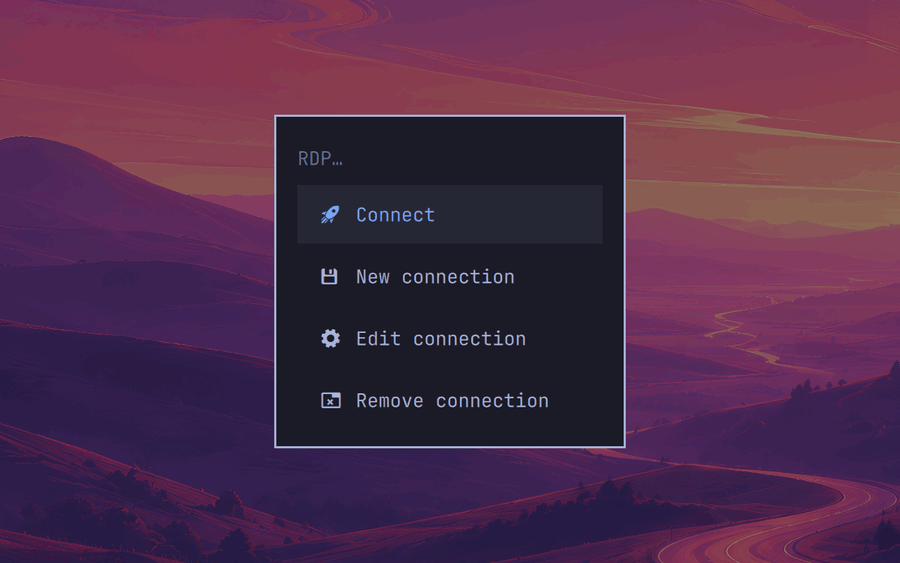
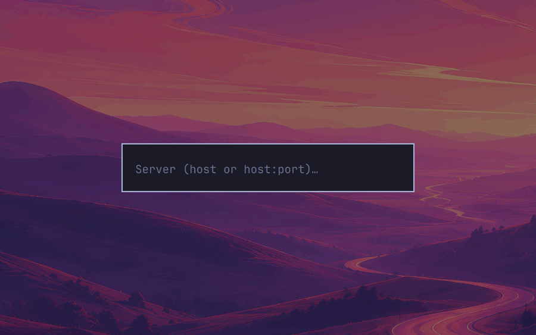
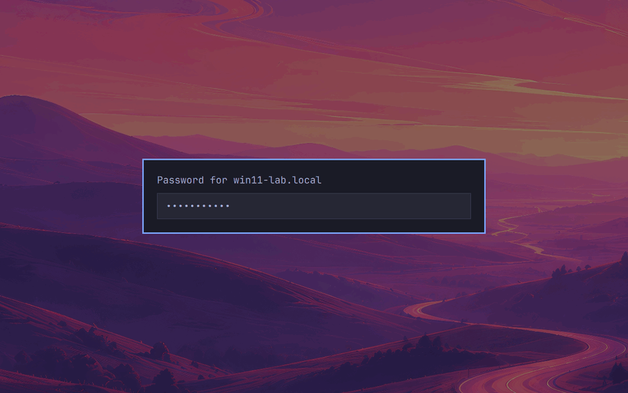
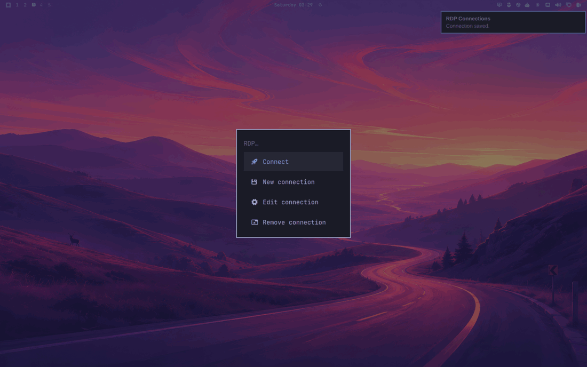
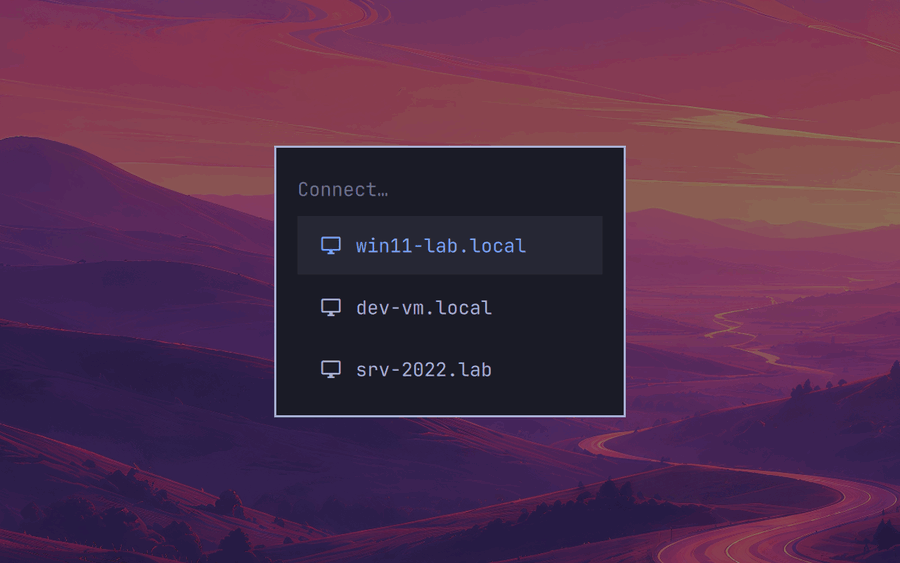
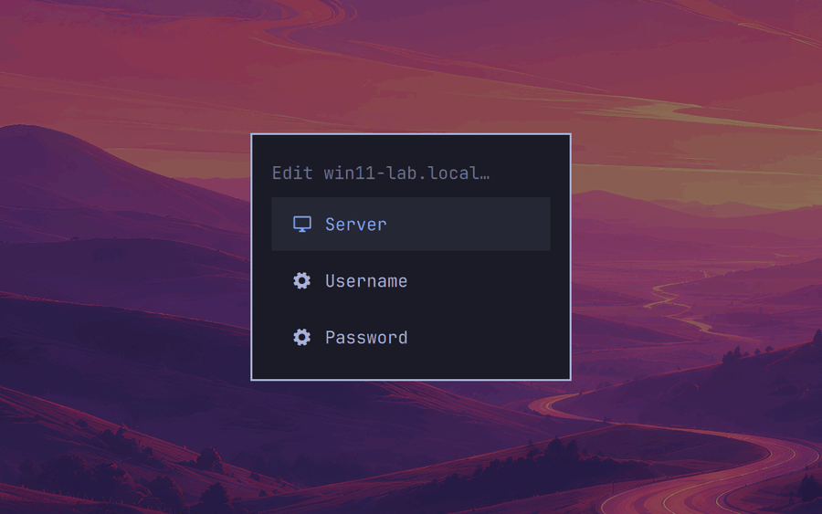
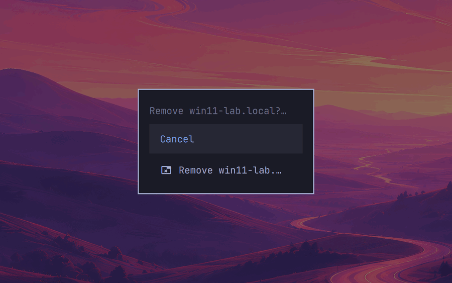

# RDP Connections

RDP Connections is an Omarchy Quattro bar widget for creating, editing, removing, and launching saved remote-desktop connections with the SDL FreeRDP client. It is designed for Hyprland multi-monitor fullscreen sessions.

## Use

Enable the plugin in Omarchy. Select **RDP** from the bar, then choose **Connect**, **New connection**, **Edit connection**, or **Remove connection**. The connection flow asks only for a server, user name, and password.

**Edit connection** additionally offers a display **Name**, a **Monitors** choice, and a **Network** choice. A new connection spans every monitor, which is the previous behavior. To narrow it, pick the screens one at a time — each pick appends to the list, and **Save this order** stores it. The order matters: FreeRDP treats the first screen in the list as the session's primary, so `DP-9` then `DP-11` is a different desktop from `DP-11` then `DP-9`. **All monitors** restores the default and **Start over** clears the current selection.

**Network** sets FreeRDP's connection type. **Auto** is the default and the same thing FreeRDP does on its own: it measures the link during the handshake and adapts as it goes. **LAN** pins the profile instead — every desktop effect stays on and the probing stops — which suits a host on the same wire and hurts over a VPN or anything whose bandwidth moves. **Broadband**, **WAN**, and **Modem** pin the correspondingly leaner profiles.

Display scaling is applied automatically. RDP only carries three scale factors, so the Hyprland scale of the session's primary screen — the first saved monitor, or the focused one when the connection spans everything — is snapped to 100%, 140%, or 180%.

Monitors are stored by connector name (`DP-11`), not by the numeric id that `sdl-freerdp3 /list:monitor` prints. Those ids are SDL display indices and shift whenever a display is plugged, unplugged, or redocked; the name is resolved to whatever id is correct at connect time. A saved screen that is not attached is skipped with a notification, and a connection whose screens are all absent falls back to spanning everything.

## Screenshots

The RDP entry appears in the right side of the Omarchy bar.

Selecting it opens the connection menu.

Creating a connection collects the server and user name, followed by a masked password field.

| Server | User name |
| --- | --- |
|  |  |

The saved confirmation does not include the connection host.

Existing connections can be selected for connection or editing.

| Connect | Edit |
| --- | --- |
|  |  |

Removing a connection starts with a confirmation screen.

The host names shown in these screenshots are documentation-only examples.

## Requirements

This plugin requires Omarchy Quattro, a Hyprland session, FreeRDP 3 with the SDL client, Secret Service support, `jq`, desktop notifications, and the standard user-session utilities supplied by Omarchy. Install these prerequisites using your distribution's normal software-management method before enabling the plugin.

The plugin does not fetch, build, or add software. It operates only within the signed-in user's graphical session.

## Installation

In Omarchy's plugin manager, add this repository and enable **RDP Connections**:

https://github.com/mdelgert/omarchy-rdp-connections

## Data handling

The connection password is stored in the user's Secret Service keyring. The server, user name, display name, monitor choice, and network type are stored as configuration in `$XDG_STATE_HOME/omarchy-rdp-connections/connections.json`, an owner-only file in an owner-only directory, keyed by the same opaque identifier used for the keyring entry.

That line is drawn deliberately. While a session is unlocked, the Secret Service is readable over D-Bus by any process running as the user, which is the same exposure as an owner-only file — so the keyring only earns its cost for the one value whose disclosure at rest cannot be undone. This is the split Remmina, `mstsc`, and `ssh_config` all make: identity and configuration in config, authentication material in the keyring. A consequence worth having is that the connection list still renders, and can still be edited or removed, while the keyring is locked; only connecting needs an unlock.

Installations created by an earlier version, which kept the server and user name in the keyring, are upgraded in place the first time the menu is opened with the keyring unlocked. The old keyring fields are cleared only after the values have been read back out of the index. The plugin does not edit Hyprland, Omarchy, shell, or bar configuration files.

The RDP client is configured for the working multi-monitor connection profile, including fullscreen, the selected monitors, audio, microphone, clipboard, camera, the H.264 4:4:4 graphics pipeline, and certificate-ignore behavior. The keyboard is grabbed for the duration of the session, which is FreeRDP's default: Hyprland's own bindings are suppressed while the session has focus, so `SUPER` and friends reach Windows instead of the host. Move focus to another window, or press `Ctrl+Alt+Enter`, to get them back. Certificate-ignore behavior bypasses server-certificate validation; connect only to hosts you trust.

## Removal

Remove every saved connection from the RDP menu first if its keyring entry and its stored configuration should also be deleted. Then remove **RDP Connections** through Omarchy's plugin manager.

## License

MIT
